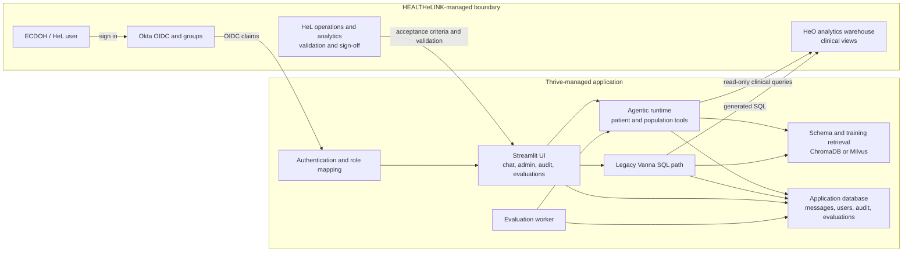
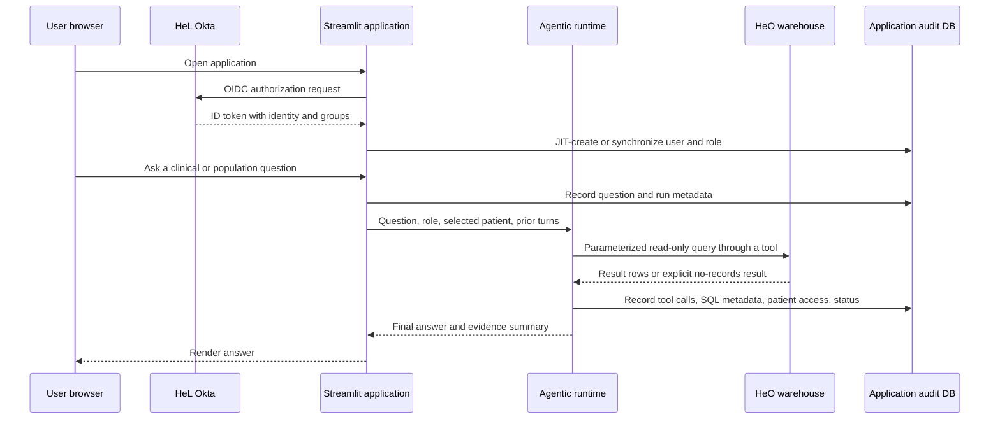

# HEALTHeINTELLIGENCE Architecture

Current implementation view as of 2026-07-16. This document describes the
deployed application boundary and the responsibilities shared by Thrive AI and
HEALTHeLINK (HeL). It deliberately leaves unresolved consent, patient identity
resolution, Public Health role mapping, and final compliance acceptance
criteria as open decisions.

## System context

## Authenticated request flow

## Component responsibilities

| Component | Responsibility | Primary implementation |
| --- | --- | --- |
| Streamlit entry and views | Session lifecycle, chat, administration, audit, and evaluation UI | `app.py`, `views/` |
| Okta integration | OIDC flow, group-to-role mapping, JIT user synchronization, logout | `utils/okta_auth.py`, `utils/auth.py` |
| Agentic runtime | Multi-turn orchestration, patient selection, tool execution, final-answer synthesis | `agent/runtime.py`, `agent/runner.py`, `agent/tools/` |
| Clinical data access | Dialect-aware, parameterized reads against HeO views | `agent/db/analytics_adapter.py`, `agent/db/queries/` |
| Legacy SQL generation | Vanna-based text-to-SQL path retained during transition | `utils/vanna_calls.py`, `utils/chat_bot_helper.py` |
| Retrieval and training context | Role-aware schema, examples, and documentation retrieval | `utils/chromadb_vector.py`, `utils/milvus_vector.py` |
| Application persistence | Users, messages, settings, agent runs, tool calls, patient access, evaluations | `orm/models.py`, `orm/agent_logging_functions.py`, `orm/logging_functions.py` |
| Audit UI | 7-, 30-, or 90-day views for queries, patients, admin actions, and user activity | `views/admin.py`, `views/admin_audit.py`, `views/admin_audit_queries.py`, `views/admin_audit_by_patient.py` |
| Evaluation workspace | Curated/feedback cases, durable runs, review history, async execution | `evals/`, `views/admin_evaluations.py` |
| Schema management | Versioned application-database migrations | `alembic/` |

## Data and security boundaries

- HeO clinical data remains in the HeL analytics warehouse. The application
  reads it through configured analytics connections; it does not treat the
  application SQLite database as a clinical source of truth.
- The application database contains identity, configuration, conversation,
  audit, and evaluation metadata. Logging mode controls how much result detail
  is retained. Evaluation retention can purge PHI payloads while preserving
  run and review audit metadata.
- Real patient rosters and evaluation outputs contain PHI or PHI pointers and
  remain uncommitted. `evals/roster.yaml`, local databases, and generated result
  artifacts are operational inputs, not repository assets.
- Role mapping is derived from Okta groups and synchronized at login. The
  current code supports Admin, Doctor, Nurse, and Patient. A distinct Public
  Health role/group requires an approved mapping before implementation.
- Consent and patient identity resolution are enforced only after their source
  rules are approved. Aggregate/de-identified exemptions and small-cell
  protections must follow the final consent decision, not an inferred rule.

## Audit and compliance baseline

The application records user activity, submitted questions, agent runs, tool
calls, executed-SQL metadata, response status/timing, and patient access. Admins
can inspect and export a rolling 90-day window from the application. Older
records remain queryable in backend audit tables subject to deployment
retention and HeL analytics access.

The remaining acceptance step for the SHIN-NY baseline is operational: HeL must
confirm the minimum required dataset and verify that its analytics users can
query the deployed backend records. Thrive's automated tests verify storage,
filtering, pagination, scope classification, and UI presentation; they do not
prove external account access.

## Validation and operations

- The authenticated evaluation workspace persists runs and per-case results,
  supports human verdicts with change history, and resumes asynchronous work
  after stale-worker recovery.
- The CLI harness accepts a gitignored patient roster and a YAML question set.
  HeL/Joe must provide the production 20-patient roster, the authoritative
  Q0-Q14 formats, and known-answer expectations before go-live scoring is
  complete.
- Deployment configuration and credentials live outside source control. The
  repository includes Alembic migrations and service definitions, while HeL
  owns the identity-provider, network, warehouse, and downstream operational
  access needed by the deployed service.

## Ownership and open decisions

| Area | Thrive responsibility | HeL / joint responsibility | Current state |
| --- | --- | --- | --- |
| Okta | OIDC client behavior and claim handling | App assignment, groups, claims, and production IdP configuration | Integrated; final IdP items external |
| Patient identity | Apply the approved resolver consistently in tools and queries | Supply and approve post-Fusion matching rules | Open |
| Consent | Implement the approved enforcement and exemption rules | Name business owner; approve population, SQL, blanks, and exceptions | Open |
| Public Health RBAC | Add approved role mapping and authorization behavior | Define role/group and permitted capabilities | Open |
| SHIN-NY audit | Persist and expose baseline audit data | Define minimum dataset and verify analytics access | Code baseline present; operational sign-off open |
| Validation | Maintain harness and remediate product defects | Supply roster/expected answers and perform UAT/revalidation | In progress |

## Code-level evidence

- Okta mapping and synchronization: `utils/okta_auth.py`
- Agent conversation continuity: `agent/runtime.py`, `agent/runner.py`
- Patient and population tools: `agent/tools/`
- Audit models and readers: `orm/models.py`, `orm/agent_logging_functions.py`,
  `orm/logging_functions.py`
- 90-day admin selector: `views/admin.py`
- Evaluation behavior and PHI handling: `evals/README.md`
